# msds-practicum-two
MS Data Science Practicum project 
# Log
**5/4/2024 1:30PM-2:30PM**
- created Jupiter NB HashSet, to verify unique file data set
- Saved successful results to csv files, combined_exes_hashes and combined_exes
- created data folder for exe files
## TODO
- Update mt_util to support argparse
- Update mt_util to process bulk imaging

**5/3/2024 8:30AM-10:15AM**
- created new repo called msds-practicum-two
- added scripts needed for work
- created folder bin to contain uncompressed exe files
- generated 5K exe in bin

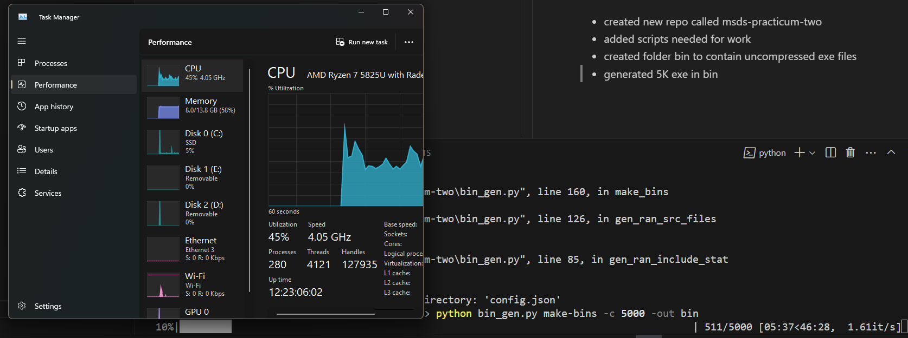

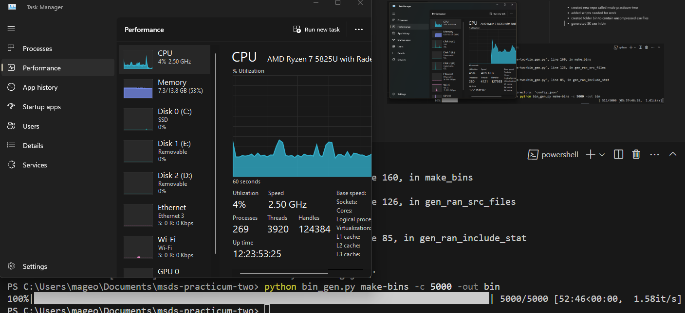

- tested 5K exe 

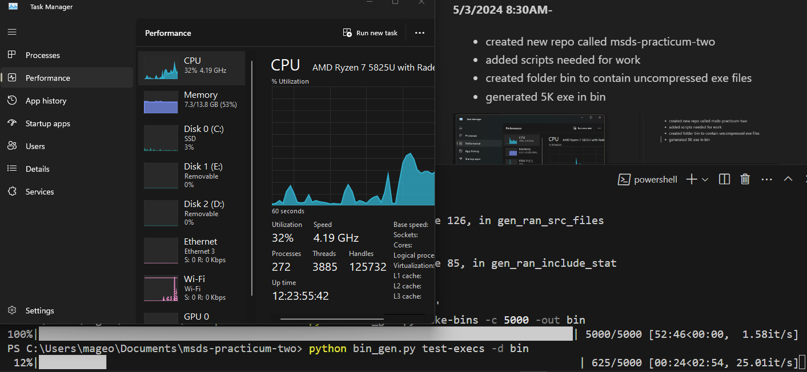

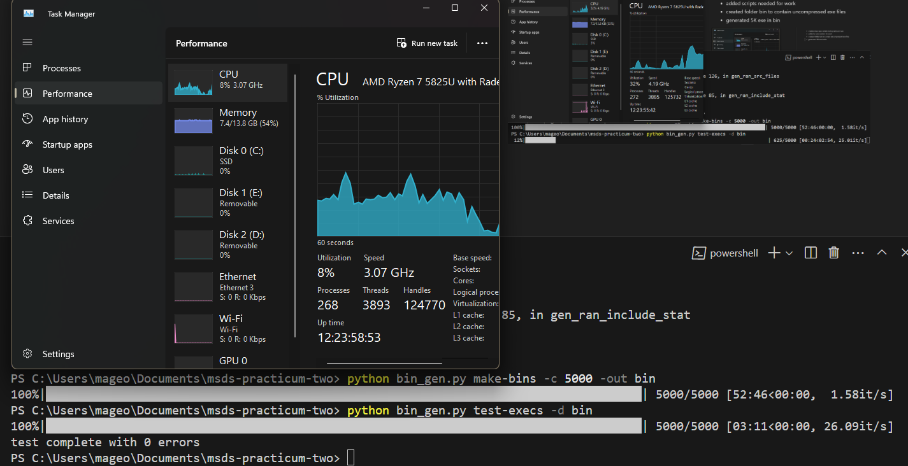

- created copy of bin folder

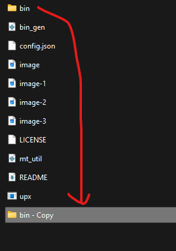

- renamed copy to upx_bin

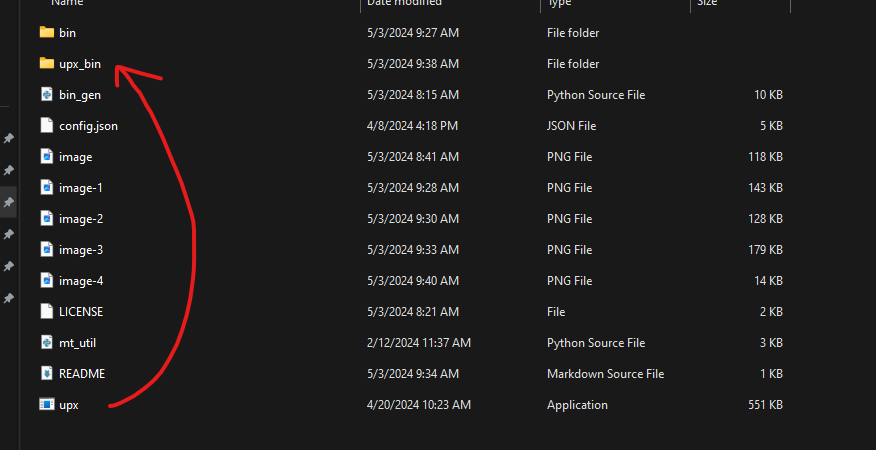

- used upx to compress all file in upx_bin

```
./upx -f upx_bin/*.*       
```

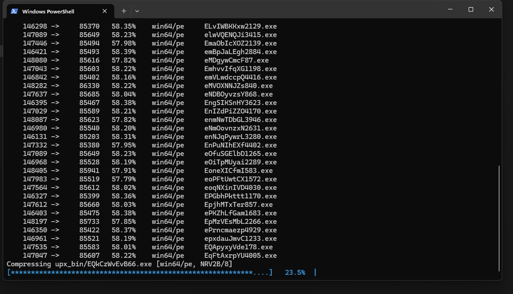

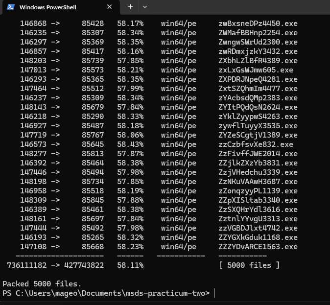

- checked folder sizes

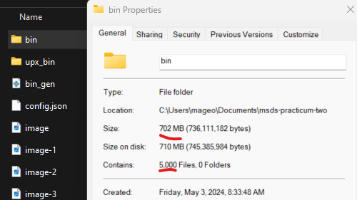

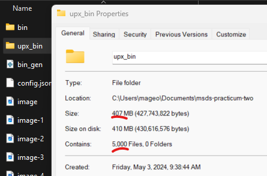

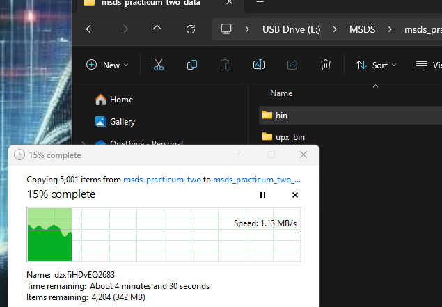

## Summary
- Generated 5K exe files in /bin
- Compressed coppies of 5K exe files /upx_bin
- backed up file data to thumb drive
- commited ReadME (log)  
## TODO
- create a Jupiter NB to hash and verify compressed files
- perform imaging of exe files
- backup work!!

